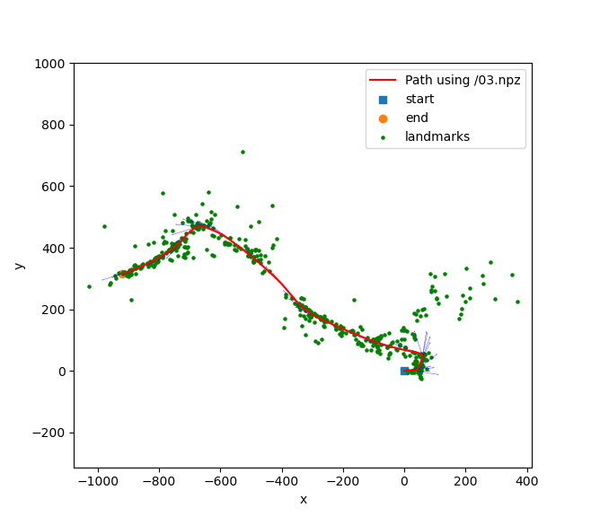
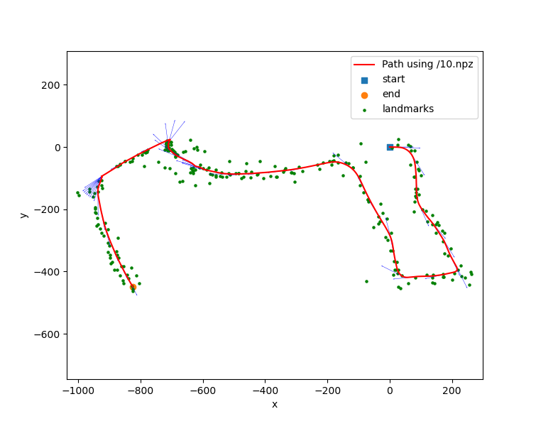

# Visual Inertial SLAM
(Cmd+Shift+V to go into markdown reader mode in Mac)
(Ctrl+Shift+V to go into markdown reader mode in Windows)

There are 3 files for each part,
1. **PR3_Prediction.py**: Part a)
2. **PR3_Pred_Update.py**: Part b)
3. **PR3_VISLAM.py**: Part c)

Each .py script is organized as follows;

## class ViSLAM 
1. **__init__**: initializes all parameters needed for the EKF; descriptions of parameters given in the code comments; parameters can be changed here
2. **se3_2_SE3**: function to convert se(3) -> SE(3) matrices
3. **hatmap**: computes skew symmetric hatmap
4. **se3_2_6x6**: computes adjoint matrix
5. **pi_func**: computes pi function (1/z)
6. **diff_pi_func**: computes the differential of pi function
7. **__name__ == '__main__'**: Mapping, prediction, update loop for EKF

## Files reqd

1. **03.npz, 10.npz**: data file to be placed in (*root_folder\data\ ....npy*)
3. **pr3_utils.py**: script containing load_data and visualization functions to be placed in (*root_folder\ ....npy*)

## Results

Note: VSCode had an update which might be casusing some error (it did for me). If this happens, please copy the code into a jupyter NB and try. It works completely fine in Jupyter. The entire code can be pasted and run from a single cell.

Please contact the undersigned in case of any questions/clarifications.

Rishabh Bhattacharya  
Mechanical and Aerospace Engineering  
ribhattacharya@ucsd.edu

